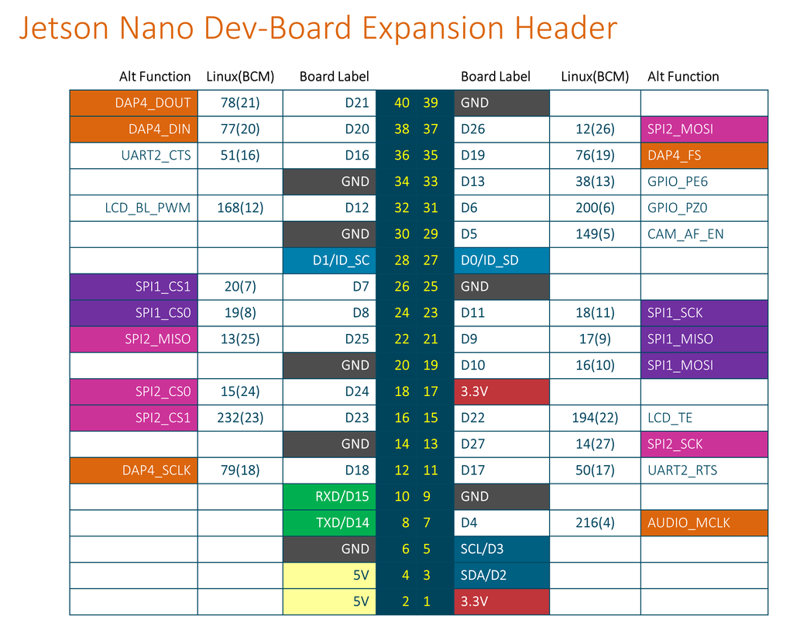

# Final integration

- [Circuit Python Link](https://learn.adafruit.com/circuitpython-libraries-on-linux-and-the-nvidia-jetson-nano?view=all)

# Power Spectrum

- Get 256 samples of ADC data and store it into a CSV file
- Calculate FFT on 256 samples of ADC data
- Calculate power spectrum using FFT and store it into a CSV file
- Later use excel sheet functionality and create graphs for the same
